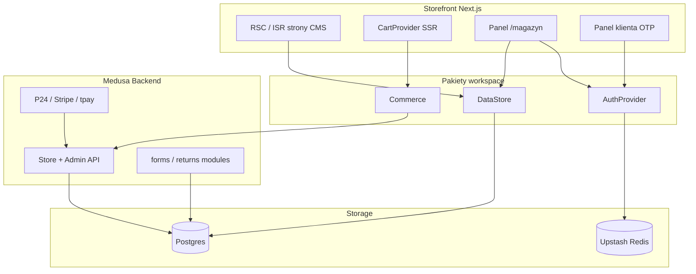

# Architektura Moduly

Moduly to monorepo (pnpm + Turborepo) dostarczające system **CMS + Magazyn + Commerce** dla projektów Syntance. Architektura opiera się na rozdzieleniu warstw persystencji, uwierzytelniania i modułów funkcjonalnych.

## Struktura monorepo

```
moduly/
├── apps/
│   ├── starter-strona/     # Starter: strona CMS (Postgres)
│   ├── starter-sklep/      # Starter: sklep + Medusa
│   └── backend/            # MedusaJS v2 (starter-sklep)
├── packages/
│   ├── types/              # Współdzielone typy (DataStore, AuthProvider, PaymentProvider)
│   ├── config/             # ModulyConfig + defaultModulyConfig
│   ├── data-store/         # Abstrakcja DataStore (Postgres + Medusa)
│   ├── auth-core/          # AuthProvider (MedusaAuth, PostgresAuth, OTP klienta)
│   ├── cms/                # Parser CMS, metadata, revalidacja
│   ├── commerce/           # Koszyk, checkout, Meilisearch
│   ├── payments/           # pickPreferredProvider, ID providerów
│   ├── magazyn-*/          # Moduły panelu administracyjnego
│   ├── client-panel/       # Panel klienta (OTP)
│   ├── legal-consent/      # Baner cookies + szablony stron prawnych
│   └── ui/                 # Komponenty UI (Tailwind v4)
├── cli/                    # @syntance/moduly — create / add
└── docs/                   # Dokumentacja + ADR
```

## DataStore

`DataStore` (`@moduly/types`) to interfejs persystencji danych panelu — CMS, formularze, zwroty, audyt. Implementacje:

| Implementacja | Kiedy | Pakiet |
|---------------|-------|--------|
| **PostgresStore** | Starter strony CMS, formularze, zwroty bez Medusa | `@moduly/data-store` |
| **MedusaStore** | Sklep — metadata w module services Medusy | `@moduly/data-store` |

Rejestracja przy starcie aplikacji:

```ts
import { setDataStore, PostgresStore } from "@moduly/data-store";

setDataStore(new PostgresStore(dbClient));
```

`requireDataStore()` rzuca błąd, gdy store nie został zarejestrowany — fail-fast zamiast cichego null.

### Zakres odpowiedzialności DataStore

- Ustawienia witryny, treść stron CMS, SEO per strona
- Formularze kontaktowe i zgłoszenia
- Zwroty i reklamacje (panel admina)
- Dziennik audytu (`recordAudit`)

**Nie obejmuje:** zamówień Medusa, produktów katalogowych, sesji płatności — to domena Medusa + `@moduly/commerce`.

## AuthProvider

`AuthProvider` (`@moduly/types`) abstrahuje logowanie administratora panelu:

| Provider | Kiedy | Klasa |
|----------|-------|-------|
| **PostgresAuth** | Starter strony, prosty panel bez Medusa | `@moduly/auth-core` |
| **MedusaAuth** | Sklep z backendem Medusa | `@moduly/auth-core` |

Konfiguracja w `moduly.config.ts`:

```ts
auth: {
  cookieName: "moduly_admin_session",
  google: false,
  provider: "postgres", // lub "medusa"
}
```

Dodatkowo `@moduly/auth-core` dostarcza:

- **CustomerOtpAuth** — panel klienta (zwroty, zamówienia) przez kod OTP e-mail
- **Rate limiting** — stub z integracją Upstash Redis (fail-open bez Redis)
- **Allowlist** — `ADMIN_ALLOWLIST_EMAILS` w ENV

## Przepływ komunikacji



### Typowe ścieżki

1. **Zapis CMS** — panel → `DataStore.savePageContent()` → Postgres → webhook/tag revalidacja → storefront ISR
2. **Checkout** — storefront → `@moduly/commerce` → Medusa cart API → `pickPreferredProvider()` → sesja płatności
3. **Zwrot klienta** — OTP e-mail → `@moduly/client-panel` → Medusa custom route → `DataStore` / module returns
4. **Admin login** — `AuthProvider.authenticate()` → cookie JWT → middleware panelu

## Konfiguracja instancji

Jeden plik `moduly.config.ts` steruje:

- Ścieżką panelu (`basePath`)
- Włączonymi modułami (`modules.*`)
- Providerem auth (`auth.provider`)
- Płatnościami (`payments.enabled`)
- Blokami CMS (`content.pages`)

Bez sekretów — klucze API tylko w ENV.

## Powiązane ADR

- [001-storage-split.md](adr/001-storage-split.md) — Medusa vs Postgres
- [002-payment-priority.md](adr/002-payment-priority.md) — kolejność providerów płatności
- [003-auth-provider.md](adr/003-auth-provider.md) — MedusaAuth vs PostgresAuth
- [004-audit-composer-vs-moduly.md](adr/004-audit-composer-vs-moduly.md) — ewolucja z podejścia „composer”
